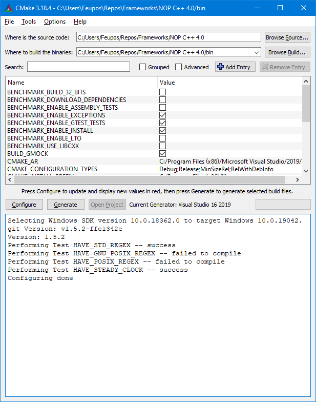

[](http://nop.dainf.ct.utfpr.edu.br/NOP-Server/NOP-Frameworks/Cpp-Framework-4_0/commits/master)
[](http://nop.dainf.ct.utfpr.edu.br/NOP-Server/NOP-Frameworks/Cpp-Framework-4_0/commits/master)

# Framework NOP C++ 4.0 (libnop) #

This framwork was developed to make it easier to build applications using the NOP in C++.
It uses CMake to build the library and applications.

## Requirements ##

* Unix or Windows (OSX is untested)
* CMake 3.14
* C++20 compatible compiler (MSVC 14.2 / GCC 10)

# Build options #

The following options must be set during cmake generation.

Usage options:

* LIBNOP_SCHEDULER_ENABLE: Enable use of schedluer for executing Rules (reduces performance)
* LIBNOP_LOG_ENABLE: Enable using logs (heavy performance hit)

Development options:

* LIBNOP_TEST_ENABLE: Enable building unity tests
* LIBNOP_COVERAGE_ENABLE: Enable code coverage
* LIBNOP_BENCHMARK_ENABLE: Enable build benchmarks
* LIBNOP_BENCHMARK_SENSOR_ENABLE: Enable build sensor benchmark
* LIBNOP_BENCHMARK_BITONIC_ENABLE: Enable build bitonic benchmark
* LIBNOP_BENCHMARK_RANDOMFOREST_ENABLE: Enable build random forest benchmark
* LIBNOP_FW2_TEST_ENABLE: Enable build NOP C++ Framework 2.0 tests

For maximum performance, all options are disabled by default.
As an alternative you can add "#define LIBNOP_SCHEDULER_ENABLE" before including "#include "NOPFramework.h"" or "#include "libnop/framework.h"" to enable the scheduler.


## Hot to build (Windows) ##

Download and install the CMake GUI for windows and generate the project for your IDE.
https://cmake.org/download/



1. Set source folder - Ex: Cpp-Framework-4_0/
2. Set build folder - Ex: Cpp-Framework-4_0/build
3. Configure the desired options
4. Generate
5. Open Project

## Hot to build (Unix) ##

1. ```mkdir build && cd build```
2. ```cmake ..```
3. ```sudo make install```

## Tests and benchmark (Unix) ##

After building you can run the tests and benchmarks:

1. ```libnop_gtest/libnop_gtest```
2. ```libnop_gbench/libnop_gbench```

## How to use ##

Include the header "libnop/framework.h" in your files.

To utilize this library in other ```CMake``` projects you can add the following lines to your CMakeLists.txt:

```
include(FetchContent)
FetchContent_Declare(libnop
	GIT_REPOSITORY http://nop.dainf.ct.utfpr.edu.br/NOP-Server/NOP-Frameworks/Cpp-Framework-4_0.git
	GIT_TAG master
)

FetchContent_GetProperties(libnop)
if(NOT libnop_POPULATED)
	FetchContent_MakeAvailable(libnop)
endif()
```

C++20 is required for use:

```CMake
set_target_properties(<target> PROPERTIES
	CXX_STANDARD 20
)
```

Alternativelly you can clone the repository and install the library in your system:

1. ```git clone http://nop.dainf.ct.utfpr.edu.br/NOP-Server/NOP-Frameworks/Cpp-Framework-4_0.git```
2. ```cd Cpp-Framework-4_0.git```
3. ```mkdir build```
4. ```cd build```
5. ```cmke ..```
6. ```sudo make install```

Then import with CMake with find_package:

```
find_package(libnop)
```
